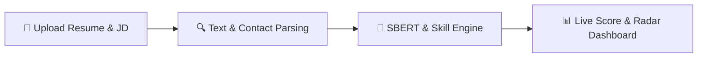

# 🔍 HireLens: AI-Powered Resume Screening, Skill Gap Analysis & Job Matching System

<div align="center">

[](https://www.python.org/)
[](https://streamlit.io/)
[](https://www.sbert.net/)
[](https://fastapi.tiangolo.com/)
[](LICENSE)

[](https://aryan8182-hirelens-ai-resume-analyzer-app-p2fpgo.streamlit.app/)

> **HireLens** is an AI-powered Applicant Tracking System (ATS) and candidate evaluation platform powered by Deep Learning, Sentence-Transformers (`all-MiniLM-L6-v2`), and Natural Language Processing (NLP).

[🚀 Live Web Application Demo](https://aryan8182-hirelens-ai-resume-analyzer-app-p2fpgo.streamlit.app/) • [📖 Project Synopsis](PROJECT_SYNOPSIS.md) • [🐛 Report Bug](https://github.com/Aryan8182/Hirelens-ai-resume-analyzer/issues)

</div>

---

## 📌 Table of Contents
- [🌟 Overview](#-overview)
- [✨ Key Features](#-key-features)
- [🏗️ System Architecture](#️-system-architecture)
- [📐 ATS Scoring Model](#-ats-scoring-model)
- [🏷️ Multi-Domain Skill Taxonomy](#️-multi-domain-skill-taxonomy)
- [🚀 Quick Start Guide](#-quick-start-guide)
- [🌐 REST API Endpoints](#-rest-api-endpoints)
- [📁 Repository Structure](#-repository-structure)
- [🧪 Testing & Verification](#-testing--verification)
- [👥 Team & Credits](#-team--credits)

---

## 🌟 Overview

Corporate recruiters receive hundreds of candidate resumes for every open job posting. Manual screening is time-consuming, subjective, and inefficient. Traditional ATS tools rely strictly on exact keyword matching, often rejecting qualified candidates who use different phrasing.

**HireLens** solves this problem using an intelligent **hybrid AI framework**:
1. **Semantic Understanding**: Uses Sentence-Transformers (`all-MiniLM-L6-v2`) to match meaning (e.g., recognizing that *"Deep Learning"* aligns with *"Machine Learning"*).
2. **Skill Coverage**: Maps candidate skills across 7 technical categories.
3. **Keyword Alignment**: Uses TF-IDF for term frequency analysis.

---

## ✨ Key Features

- **🎯 Single Resume Deep Evaluation**: Instant match scores, suitability grades, and non-capturing contact detail parsing (Email, Phone, LinkedIn, GitHub).
- **🏆 Batch Candidate Ranking**: Rank multiple resumes at once against a target job description.
- **🕸️ Multi-Domain Skill Radar**: Plotly polar radar charts comparing candidate skills against job requirements.
- **📜 SQLite Log & One-Click Reset**: History persistence in `ats_history.db` with one-click clear log functionality.
- **🎛️ Dynamic Formula Sliders**: Adjust SBERT, Skill Coverage, and TF-IDF weights in real time.
- **🎨 Dark Glassmorphic UI**: High-contrast, Vercel/Linear AI-inspired dark design system.
- **🌐 FastAPI REST Server**: Headless API endpoints (`/docs`) for easy backend integration.

---

## 🏗️ System Architecture



---

## 📐 ATS Scoring Model

The **HireLens ATS Match Score** combines three NLP scoring components:

$$\text{ATS Match Score} = (0.45 \times \text{SBERT Match}) + (0.35 \times \text{Skill Coverage}) + (0.20 \times \text{TF-IDF Match})$$

- **SBERT Semantic Similarity (45%)**: Measures context and conceptual meaning using Transformer embeddings (`all-MiniLM-L6-v2`).
- **Skill Coverage Ratio (35%)**: Percentage of required technical skills present in the candidate's resume.
- **TF-IDF Keyword Similarity (20%)**: Term frequency analysis for exact keyword verification.

---

## 🏷️ Multi-Domain Skill Taxonomy

Candidate competencies are categorized across **7 domain buckets**:

| Category | Key Competencies Captured |
| :--- | :--- |
| **Programming Languages** | Python, C++, Java, JavaScript, TypeScript, Go, Rust, R, SQL, Swift |
| **Machine Learning & AI** | PyTorch, TensorFlow, Scikit-Learn, OpenCV, SpaCy, HuggingFace, RAG, LLM |
| **Web Development** | React, Node.js, FastAPI, Flask, Django, HTML5, CSS3, Tailwind, REST API |
| **Cloud & DevOps** | AWS, Azure, GCP, Docker, Kubernetes, CI/CD, Terraform, Linux, Git, GitHub |
| **Databases** | PostgreSQL, MySQL, MongoDB, Redis, SQLite, Pinecone, ChromaDB |
| **Frameworks & Tools** | Pandas, NumPy, Matplotlib, Seaborn, Jupyter Notebooks, VS Code, JIRA |
| **Soft Skills** | Leadership, Problem Solving, Critical Thinking, Communication, Teamwork |

---

## 🚀 Quick Start Guide

### Prerequisites
- Python 3.10+ installed.

### 1. Clone the Repository
```bash
git clone https://github.com/Aryan8182/Hirelens-ai-resume-analyzer.git
cd Hirelens-ai-resume-analyzer
```

### 2. Install Dependencies
```bash
pip install -r requirements.txt
```

### 3. Launch Streamlit Web Application
```bash
streamlit run app.py
```
Open **`http://localhost:8501`** in your web browser.

### 4. (Optional) Run FastAPI REST Service
```bash
uvicorn api:app --reload
```
View API documentation at **`http://localhost:8000/docs`**.

---

## 🌐 REST API Endpoints

| Endpoint | Method | Description |
| :--- | :---: | :--- |
| `/` | `GET` | API Healthcheck & metadata |
| `/docs` | `GET` | Interactive Swagger UI API documentation |
| `/api/v1/parse-resume` | `POST` | Upload PDF/DOCX; returns parsed text & contact details |
| `/api/v1/analyze-match` | `POST` | Accepts JSON payload; returns ATS scores & skill gap analysis |

---

## 📁 Repository Structure

```
Hirelens-ai-resume-analyzer/
├── app.py                      # Streamlit Web Application & Dark UI
├── resume_parser.py            # PDF/DOCX Parser & Contact Extractor
├── skill_extractor.py          # 7-Category NLP Taxonomy & Skill Matcher
├── ats_matcher.py              # SBERT Embedding Generator & Match Engine
├── recommendation_engine.py    # Formatting Audit & Actionable Advice Engine
├── db_manager.py               # SQLite History Logger & Clear Log Manager
├── api.py                      # FastAPI REST API Microservice
├── test_suite.py               # Unit Testing Suite
├── headless_test.py            # 6-Module Full Verification Script
├── PROJECT_SYNOPSIS.md         # B.Tech Project Synopsis Document
├── HireLens_Presentation.pptx  # 10-Slide Widescreen Presentation
├── README.md                   # Repository Documentation
├── requirements.txt            # Python Dependencies
└── sample_data/                # Preset Test Resume & Job Description
```

---

## 🧪 Testing & Verification

Run the full automated verification suite:
```bash
python headless_test.py
```

Run unit tests:
```bash
python -m unittest test_suite.py
```

---

## 👥 Team & Credits

**Panipat Institute of Engineering & Technology (PIET)**  
*Department of Artificial Intelligence & Machine Learning (B.Tech 3rd Year)*

- **Aryan** (Roll No: **28240533**)
- **Nitish** (Roll No: **28240529**)

- **GitHub Repository**: [Aryan8182/Hirelens-ai-resume-analyzer](https://github.com/Aryan8182/Hirelens-ai-resume-analyzer)
- **Live Application**: [https://aryan8182-hirelens-ai-resume-analyzer-app-p2fpgo.streamlit.app/](https://aryan8182-hirelens-ai-resume-analyzer-app-p2fpgo.streamlit.app/)
- **License**: MIT License
