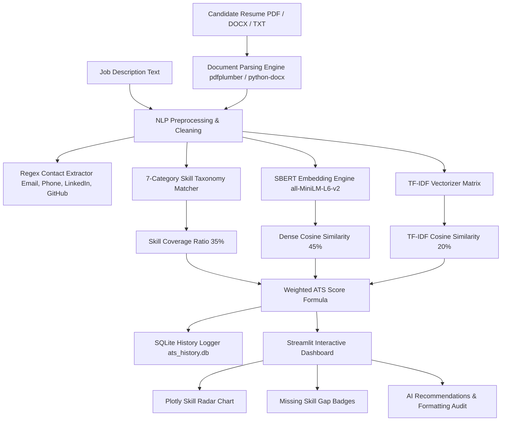

# 🔍 HireLens: AI-Powered Resume Screening, Skill Gap Analysis & Job Matching System

<div align="center">

[](https://www.python.org/)
[](https://streamlit.io/)
[](https://www.sbert.net/)
[](https://fastapi.tiangolo.com/)
[](LICENSE)

[](https://share.streamlit.io/deploy?repository=Aryan8182/Hirelens-ai-resume-analyzer&branch=main&mainModule=app.py)
[](https://share.streamlit.io/deploy?repository=Aryan8182/Hirelens-ai-resume-analyzer&branch=main&mainModule=app.py)

> **HireLens** is a next-generation Applicant Tracking System (ATS) and candidate evaluation platform powered by Deep Learning, Sentence-Transformers (`all-MiniLM-L6-v2`), and Natural Language Processing (NLP).

[🚀 1-Click Live Deploy Link](https://share.streamlit.io/deploy?repository=Aryan8182/Hirelens-ai-resume-analyzer&branch=main&mainModule=app.py) • [📖 Project Synopsis](PROJECT_SYNOPSIS.md) • [🐛 Report Bug](https://github.com/Aryan8182/Hirelens-ai-resume-analyzer/issues)

</div>

---

## 📌 Table of Contents
- [🌟 Overview](#-overview)
- [✨ Key Features](#-key-features)
- [🏗️ System Architecture](#️-system-architecture)
- [📐 Mathematical ATS Scoring Model](#-mathematical-ats-scoring-model)
- [🏷️ NLP Multi-Domain Skill Taxonomy](#️-nlp-multi-domain-skill-taxonomy)
- [🚀 Quick Start Guide](#-quick-start-guide)
- [🌐 REST API Endpoints](#-rest-api-endpoints)
- [🎓 Viva Defense Cheat Sheet](#-viva-defense-cheat-sheet)
- [📁 Repository Structure](#-repository-structure)
- [🧪 Testing & Verification](#-testing--verification)
- [👤 Author & License](#-author--license)

---

## 🌟 Overview

In modern talent acquisition, human resource departments receive hundreds of applicant resumes for every open requisition. Manual screening is time-consuming, subjective, and prone to recruiter fatigue. Traditional ATS solutions rely on rigid keyword matching, often disqualifying top-tier candidates who express equivalent expertise using synonymous terminology.

**HireLens** addresses this bottleneck by deploying a **hybrid scoring framework**:
1. **Dense Vector Semantics**: Uses Transformer-based embeddings (`all-MiniLM-L6-v2`) to capture context and intent (e.g., recognizing that *"Deep Learning Neural Networks"* matches *"Machine Learning Engineer"*).
2. **TF-IDF Term Weighting**: Measures exact keyword frequency and document statistics.
3. **Taxonomy Skill Coverage**: Maps applicant competencies across 7 standardized technical domains to calculate hard-skill coverage ratios.

---

## ✨ Key Features

- **🎯 Deep Single Resume Screening**: Upload PDF, DOCX, or TXT resumes to generate an instant ATS match grade (*Exceptional Fit*, *Strong Fit*, *Moderate Fit*, *Low Fit*).
- **🏆 Batch Candidate Leaderboard**: Process multiple resumes at once against a target Job Description to rank candidates on an interactive leaderboard.
- **🕸️ Multi-Domain Skill Radar**: Renders interactive Plotly polar radar charts comparing candidate skill profiles directly against target role requirements.
- **👤 Robust Contact Audit**: Uses non-capturing regex patterns to extract clean contact details (Email, Full 10-13 Digit Phone Numbers with Country Codes, LinkedIn, GitHub).
- **📜 SQLite Audit Log & One-Click Reset**: Logs all candidate evaluations in `ats_history.db` with one-click clear history capabilities.
- **🎛️ Live Dynamic Weighting**: Sidebar sliders allowing recruiters to adjust SBERT, Skill Coverage, and TF-IDF formula weights in real time.
- **🎨 Glassmorphic Dark UI**: Custom-styled Vercel/Linear AI-inspired dark UI with bright high-contrast text and glowing metric cards.
- **🌐 FastAPI REST Server**: Includes headless OpenAPI Swagger endpoints (`/docs`) for easy backend integration.

---

## 🏗️ System Architecture



---

## 📐 Mathematical ATS Scoring Model

The overall **ATS Match Score** is computed as a linear combination of three normalized NLP scores:

$$\text{ATS Match Score} = \left( w_{\text{sbert}} \times \text{Sim}_{\text{SBERT}} \right) + \left( w_{\text{skill}} \times \text{Coverage}_{\text{Skill}} \right) + \left( w_{\text{tfidf}} \times \text{Sim}_{\text{TF-IDF}} \right)$$

Default normalized weights:
- $w_{\text{sbert}} = 0.45$ (SBERT Semantic Similarity)
- $w_{\text{skill}} = 0.35$ (Taxonomy Skill Coverage)
- $w_{\text{tfidf}} = 0.20$ (TF-IDF Keyword Similarity)

### SBERT Cosine Similarity:
Given dense 384-dimensional vector representations $\vec{u}$ (Resume) and $\vec{v}$ (Job Description) generated by `all-MiniLM-L6-v2`:

$$\text{Sim}_{\text{SBERT}}(\vec{u}, \vec{v}) = \frac{\vec{u} \cdot \vec{v}}{\|\vec{u}\| \|\vec{v}\|} = \frac{\sum_{i=1}^{384} u_i v_i}{\sqrt{\sum_{i=1}^{384} u_i^2} \sqrt{\sum_{i=1}^{384} v_i^2}}$$

### Hybrid Match Comparison Matrix:

| Feature Dimension | SBERT Dense Embedding | TF-IDF Keyword Matrix |
| :--- | :--- | :--- |
| **Matching Logic** | Contextual & Semantic Meaning | Exact Literal Keyword Match |
| **Synonym Handling** | ✅ Excellent (Recognizes *NLP* $\approx$ *Text Mining*) | ❌ Poor (Requires exact string match) |
| **Dimension Size** | 384-Dimensional Dense Vector | Sparse Vocabulary Vector |
| **Primary Strength** | Evaluates candidate experience context | Verifies hard keyword requirements |

---

## 🏷️ NLP Multi-Domain Skill Taxonomy

**HireLens** categorizes technical and soft competencies into **7 domain buckets**:

| Category | Sample Key Terms Captured |
| :--- | :--- |
| **Programming Languages** | Python, C++, Java, JavaScript, TypeScript, Go, Rust, R, SQL, Swift |
| **Machine Learning & AI** | PyTorch, TensorFlow, Scikit-Learn, Keras, OpenCV, SpaCy, HuggingFace, RAG, LLM |
| **Web Development** | React, Node.js, FastAPI, Flask, Django, HTML5, CSS3, Tailwind, REST API |
| **Cloud & DevOps** | AWS, Azure, GCP, Docker, Kubernetes, CI/CD, Terraform, Linux, Git, GitHub |
| **Databases** | PostgreSQL, MySQL, MongoDB, Redis, SQLite, Pinecone, ChromaDB |
| **Frameworks & Tools** | Pandas, NumPy, Matplotlib, Seaborn, Jupyter, VSCode, JIRA |
| **Soft Skills** | Leadership, Problem Solving, Critical Thinking, Communication, Teamwork |

---

## 🚀 Quick Start Guide

### Prerequisites
- Python 3.10 or higher installed on your system.

### 1. Clone the Repository
```bash
git clone https://github.com/Aryan8182/Hirelens-ai-resume-analyzer.git
cd Hirelens-ai-resume-analyzer
```

### 2. Create a Virtual Environment (Recommended)
```bash
# Windows
python -m venv venv
venv\Scripts\activate

# Linux / macOS
python3 -m venv venv
source venv/bin/activate
```

### 3. Install Required Dependencies
```bash
pip install -r requirements.txt
```

### 4. Run the Streamlit Application
```bash
streamlit run app.py
```
Open **`http://localhost:8501`** in your web browser.

### 5. (Optional) Run FastAPI REST Microservice
```bash
uvicorn api:app --reload
```
View interactive Swagger API documentation at **`http://localhost:8000/docs`**.

---

## 🌐 REST API Endpoints

| Endpoint | Method | Description |
| :--- | :---: | :--- |
| `/` | `GET` | API Healthcheck and status payload |
| `/docs` | `GET` | Interactive Swagger UI API documentation |
| `/api/v1/parse-resume` | `POST` | Upload PDF/DOCX file; returns extracted text & contact audit |
| `/api/v1/analyze-match` | `POST` | Accepts JSON text payload; returns ATS scores, skill gaps & recommendations |

---

## 🎓 Viva Defense Cheat Sheet

> [!TIP]
> **Q1: What problem does Sentence-Transformers (SBERT) solve over traditional ATS software?**  
> **Answer**: Traditional ATS systems rely on exact string matching. If a job requires *"Deep Learning"* and a candidate writes *"Neural Networks"*, standard ATS assigns 0 match. SBERT converts sentences into 384-dimensional dense vectors where semantically similar concepts sit close together in vector space, resulting in accurate semantic match scores.

> [!TIP]
> **Q2: Why combine SBERT with TF-IDF and Skill Coverage?**  
> **Answer**: SBERT measures conceptual similarity, Skill Coverage ensures critical technical tools (e.g. *Docker*, *SQL*) are explicitly present, and TF-IDF measures term frequency. Combining all three provides a balanced, transparent ATS score.

> [!TIP]
> **Q3: How are contact details parsed accurately without regex truncation?**  
> **Answer**: We use non-capturing regex groups `(?:...)` paired with `re.finditer()`. This guarantees `m.group(0)` returns the complete full phone string (including country code `+91-7058291048`) rather than truncated tuples.

---

## 📁 Repository Structure

```
Hirelens-ai-resume-analyzer/
├── app.py                      # Main Streamlit Web Application & Dark UI
├── resume_parser.py            # PDF/DOCX Text Parsing & Contact Extractor
├── skill_extractor.py          # 7-Category NLP Taxonomy & Skill Matcher
├── ats_matcher.py              # SBERT Embedding Generator & TF-IDF Formula
├── recommendation_engine.py    # Formatting Audit & Actionable Advice Engine
├── db_manager.py               # SQLite History Logger & Clear Log Manager
├── api.py                      # FastAPI REST API Microservice
├── test_suite.py               # Automated Unit Testing Suite
├── headless_test.py            # 6-Module Full Verification Script
├── PROJECT_SYNOPSIS.md         # B.Tech Project Synopsis Report Document
├── README.md                   # Repository Documentation
├── requirements.txt            # Python Package Dependencies
└── sample_data/                # Preset Test Data (ML Job Description & Resume)
```

---

## 🧪 Testing & Verification

Run the full 6-module automated verification suite:
```bash
python headless_test.py
```

Run unit tests:
```bash
python -m unittest test_suite.py
```

---

## 👥 Team & Credits

**Panipat Institute of Engineering & Technology (PIET)**  
*Department of Artificial Intelligence & Machine Learning (B.Tech 3rd Year)*

- **Aryan** (Roll No: **28240533**)
- **Nitish** (Roll No: **28240529**)

- **GitHub Repository**: [Aryan8182/Hirelens-ai-resume-analyzer](https://github.com/Aryan8182/Hirelens-ai-resume-analyzer)
- **Live Application**: [https://hirelens-ai-resume-analyzer.streamlit.app/](https://hirelens-ai-resume-analyzer.streamlit.app/)
- **License**: MIT License
